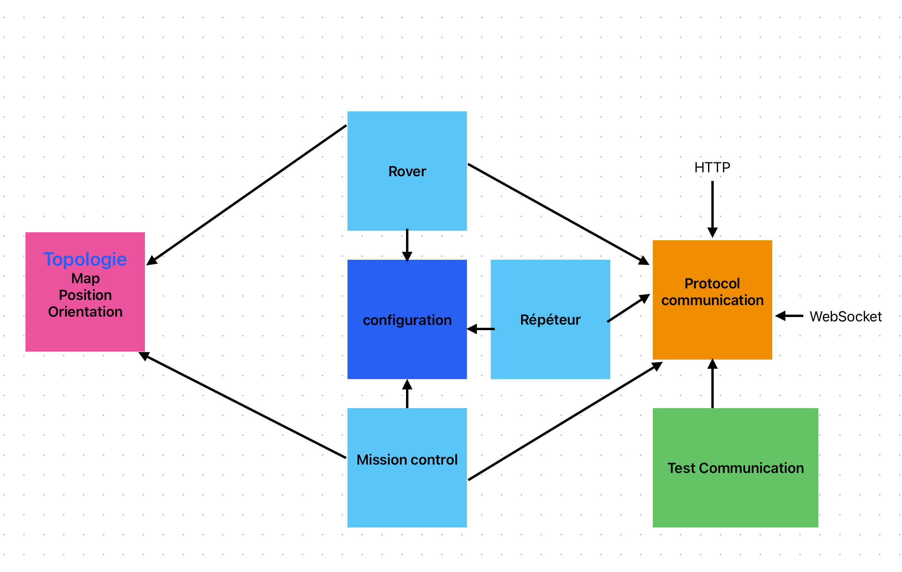

# Mars Rover

Ce projet simule le déplacement d'un Rover sur la planète Mars, en prenant en compte sa position initiale, son orientation, et sa capacité à avancer, reculer, et tourner de 90° sur lui-même dans les deux sens. Le Rover renvoie son état, comprenant sa position et son orientation, après chaque commande.

## Instructions

Avant de commencer, assurez-vous d'installer les dépendances nécessaires en exécutant la commande suivante dans votre terminal :

```bash
npm install
```

## Configurer le projet

Assurez-vous de configurer correctement le serveur en créant le fichier d'environnement via la commande suivante : (puis en l'éditant)

```bash
cp .env.example .env
```

## Lancer le Projet

Pour démarrer le projet, utilisez la commande (choisir en fonction du main à lancer) :

```bash
npm start -- {'main/missionControl.ts' || 'main/repeteur.ts' || 'main/rover.ts'}
```

## Exécuter les Tests

Pour exécuter les tests du projet, utilisez la commande :

```bash
npm run test
```

## Fonctionnalités du Rover

Le Rover dispose des fonctionnalités suivantes :

- Avancer: Déplace le Rover vers l'avant dans la direction actuelle.
- Reculer: Déplace le Rover en sens inverse de sa direction actuelle.
- Tourner à Droite: Fait tourner le Rover de 90° dans le sens horaire.
- Tourner à Gauche: Fait tourner le Rover de 90° dans le sens anti-horaire.

## Environnement Planétaire

Les planètes sont considérées comme toroïdales, ce qui signifie que si le Rover atteint un bord de la planète, il réapparaîtra de l'autre côté, simulant ainsi un environnement continu. De plus, la taille de la planète est spécifiée en entiers, ce qui implique des dimensions discrètes.

N'oubliez pas de consulter le fichier package.json pour toute autre information sur les scripts disponibles et les dépendances du projet.


